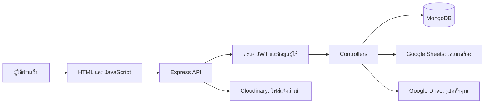

# SILMIN MOBILE — เอกสารทำความเข้าใจระบบ

สำรวจจากโค้ดใน workspace วันที่ 6 ตุลาคม 2026

เอกสารนี้อธิบายพฤติกรรมที่โค้ดปัจจุบันทำจริง รวมถึงส่วนที่มีโค้ดรองรับแต่ยังเชื่อมต่อไม่ครบ ไม่ได้ยืนยันข้อมูลจริงใน MongoDB หรือการทำงานของบัญชี Google/Cloudinary ที่ใช้งานอยู่ และไม่ได้เริ่มเซิร์ฟเวอร์ เพราะขั้นตอนเริ่มระบบมีการเขียนข้อมูล seed ลงฐานข้อมูล

## 1. ภาพรวมธุรกิจ

ระบบเว็บสำหรับประสานงานส่วนกลางและสาขาร้านมือถือ มีงานหลักดังนี้

1. มอบหมายงาน ติดตามสถานะ แสดงความคิดเห็น และแจ้งเตือน
2. บันทึกมัดจำลูกค้า ติดตามการจัดหาเครื่อง และรับเครื่อง
3. แจ้งนำเข้าโทรศัพท์/อุปกรณ์เสริม พร้อมเอกสารและ IMEI
4. เบิกสินค้า จัดหา ส่งให้ฝ่ายเทคนิค จัดส่ง และติดตามรายการค้างส่ง
5. สั่งสินค้าไปลงสาขาและยืนยันการมาถึง
6. เคลมอุปกรณ์เสริมและพิมพ์เอกสาร
7. แจ้งซ่อม/เคลมเครื่องผ่านข้อมูล Google Sheets
8. ตรวจเครื่องรายวันพร้อมหลักฐาน และให้ส่วนกลางตรวจซ้ำ
9. ตรวจนับสาขาเป็นรอบ รวมเครื่อง อุปกรณ์ และหลักฐานโอนย้าย
10. ตรวจอุปกรณ์เสริมรายวัน ส่งผลนับ อนุมัติ หรือส่งกลับ
11. ดูสต็อกคงเหลือ เปรียบเทียบสองวัน และสินค้าค้างสต็อก
12. จัดการผู้ใช้และดูประวัติกิจกรรม

หน้าเลือกบริษัทกำหนดไว้สองบริษัท: `company_1_id` = ซิลมีน โมบาย จำกัด และ `company_2_id` = เอสจี พลัส 2023 จำกัด แต่การแยกข้อมูลบริษัทไม่ได้ใช้ครบทุกโมดูล

## 2. สถาปัตยกรรมและโครงสร้างไฟล์

| ส่วน | ไฟล์/โฟลเดอร์ | หน้าที่ |
|---|---|---|
| จุดเริ่มระบบ | `server.js` | โหลด config เชื่อม DB เปิด static files จัดเส้นทาง API และตั้ง cron |
| ฐานข้อมูล | `config/db.js` | เชื่อม MongoDB และเติม ProductCatalog ตั้งต้นแบบ upsert |
| โครงสร้างข้อมูล | `models/` | 13 Mongoose models |
| API | `routes/` | 14 กลุ่มเส้นทาง รวม 71 route declarations |
| กฎการทำงาน | `controllers/` | 14 controllers |
| การยืนยันตัวตน | `middleware/` | JWT, role และสิทธิ์ admin |
| บริการร่วม | `utils/` | Google Drive และ Activity Log |
| หน้าจอ | `HTML/` | 10 หน้า HTML พร้อม CSS/JavaScript ในไฟล์ |
| สคริปต์หน้าจอร่วม | `HTML/js/` | API wrapper, toast, confirm dialog |
| รูปแบรนด์ | `image/` | โลโก้และไอคอน 4 ไฟล์ที่ติดตามใน Git |
| ไฟล์ชั่วคราว | `uploads/` | ที่พักไฟล์นำเข้า เปิดให้เรียกผ่าน `/uploads` |
| Deploy | `vercel.json` | ส่งทุก request ไป `server.js` ด้วย `@vercel/node` |
| สคริปต์ย้ายรูป | `migrate-images.js` | ย้ายรูปเก่าจาก Cloudinary ไป Drive พร้อมลบต้นฉบับ |
| โค้ดประกอบ | `temp.js`, `HTML/stock-dashboard-lines.txt` | โค้ดหน้ารายงาน/สำเนาบางส่วน ไม่พบการเรียกจาก runtime หลัก |

Backend เป็น Node.js CommonJS + Express 5 ใช้ Mongoose 8; frontend เป็น HTML/JavaScript ธรรมดา ไม่มี React/Vue และไม่มีขั้นตอน build frontend ใน package scripts

ไลบรารีหลักฝั่ง server: bcryptjs, jsonwebtoken, multer, Cloudinary storage, googleapis, axios, csv-parser, xlsx, xlsx-js-style และ node-cron

หน้าเว็บใช้ CDN ได้แก่ Tailwind, Ionicons, Toastify, SweetAlert2, Tom Select, SheetJS และ Google Fonts ตามแต่ละหน้า จึงมีการพึ่งพาเครือข่ายภายนอกขณะเปิดหน้าเว็บ

## 3. การเริ่มระบบและเส้นทางหน้าเว็บ

ลำดับใน `server.js`:

1. โหลด environment และ controllers/routes
2. เรียก `connectDB()` แบบ async โดยไม่ได้ await ก่อนรับ request
3. เปิด CORS และ JSON body parser
4. เปิด static จาก `HTML`, `/image` และ `/uploads`
5. mount API ทั้ง 14 กลุ่ม
6. กำหนด `/` ให้ส่ง `login.html` และ `/dashboard` ให้ส่ง `index.html`
7. เพิ่ม global error handler; production ซ่อนข้อความ error ภายใน
8. ตั้ง cron เวลา 02:00 Asia/Bangkok
9. เมื่อเรียกตรงด้วย Node จะ listen ที่ `PORT` หรือ 5000; เมื่อถูก import จะ export `app`

ข้อสังเกต: static middleware อยู่ก่อน route `/` และใน HTML มี `index.html` ดังนั้น static สามารถตอบหน้า index ที่ `/` ก่อนถึง handler login ได้ แล้ว frontend ที่ไม่มี token จะ redirect ไป login อีกที

`connectDB()` เติมรายการสินค้าเริ่มต้นด้วย `$setOnInsert` ทุกครั้งที่เชื่อมสำเร็จ และมี debug query ตรวจผู้ใช้ชื่อ admin/จำนวน ImportRequest หากเชื่อม DB ไม่ได้จะ `process.exit(1)`

## 4. ผู้ใช้ สิทธิ์ และ session

### 4.1 โครงสร้างผู้ใช้

`User` มี username แบบ unique, password hash, name, companyId, role, department, branch, reportsTo และ createdAt

role ที่ schema ยอมรับจริงคือ `executive`, `manager`, `hr`, `staff` เท่านั้น แม้หลาย controllers และหน้าเว็บจะมีเงื่อนไข `admin` อยู่ด้วย

`reportsTo` อ้างอิงผู้ใช้หัวหน้า แต่ไม่พบการใช้โครงสร้างสายบังคับบัญชานี้เพื่อกรองสิทธิ์งาน การมองเห็นงานอิงบริษัท ผู้รับผิดชอบ และสาขาเป็นหลัก ไม่มี Company model หรือ Branch model แยกต่างหาก

### 4.2 เข้าสู่ระบบ

1. `login.html` ส่ง username/password ไป `/api/auth/login`
2. server ค้น User และเทียบ bcrypt hash
3. สร้าง JWT ซึ่งไม่มีวันหมดอายุ โดยใส่ id, name, role, companyId, department, branch
4. frontend เก็บ `token` และ `user` ใน localStorage แล้วไป `/dashboard`
5. request ที่ต้อง login แนบ `Authorization: Bearer ...`
6. middleware ตรวจลายเซ็น JWT แล้วอ่าน User จาก DB อีกครั้งโดยตัด password ออก ดังนั้นสิทธิ์ฝั่ง server ใช้ข้อมูลผู้ใช้ล่าสุดจาก DB

frontend ใช้ user ที่เก็บใน localStorage ควบคุมเมนู จึงอาจยังแสดงเมนูตามสิทธิ์เก่าหลังมีการแก้ User จนกว่าจะ login ใหม่

`protectAdmin` อนุญาต executive/manager/hr สำหรับจัดการผู้ใช้และดู logs ส่วนสิทธิ์แผนก เช่น ขาย จัดซื้อ เทคนิค สต๊อก บัญชี ใช้ค้นข้อความใน department ซึ่งแต่ละไฟล์ใช้ keyword และความไวต่อตัวพิมพ์ต่างกัน

### 4.3 หน้าแรกตามบทบาท

| บทบาท | พฤติกรรมหน้าหลัก |
|---|---|
| staff | เปิดงานของฉัน ซ่อน dashboard/admin และตัวเลือกบริษัท |
| executive | เปิด dashboard และซ่อนงานของฉัน |
| manager/hr | เปิด dashboard และยังมีงานของฉัน |

เมนูเฉพาะแผนกถูกซ่อน/แสดงใน `initializeAuth()` แต่การซ่อนเมนูไม่ใช่การบังคับสิทธิ์ API

### 4.4 การจัดการ session

- `index.html` และ `document.html` ดัก fetch ที่ตอบ 401 แล้วล้าง token/user และไป login
- `HTML/js/api.js` ดักทั้ง 401 และ 403 แล้ว logout; หน้าอุปกรณ์เสริมและตรวจเครื่องรายวันใช้ wrapper นี้
- logout หลักลบ token/user และหยุด polling; server ไม่มี token blacklist หรือ endpoint revoke
- `login.html` เรียก `localStorage.clear()` จึงล้างข้อมูลร่างตรวจนับสาขาที่เก็บใน origin เดียวกันด้วย
- register/login ใช้ JWT_SECRET หรือ fallback แต่ middleware ใช้ JWT_SECRET โดยตรง หากไม่ได้ตั้ง secret การสร้างและตรวจ token จะไม่สอดคล้องกัน

## 5. แผนที่หน้าจอ

| หน้า | การทำงาน |
|---|---|
| `login.html` | เข้าสู่ระบบ แสดง error และข้อความ session หมดอายุ |
| `index.html` | ศูนย์กลาง dashboard/tasks, deposit, purchasing, imports, stock requests, branch orders, accessory claims, device claim links, users และ activity logs |
| `stock-management.html` | นำเข้าเครื่องรายวัน สรุปวันนี้ ดูหลักฐาน อนุมัติ/ไม่ผ่าน/ให้ตรวจใหม่ และแก้ข้อมูลสินค้า |
| `stock-dashboard.html` | รายงานตามช่วงเวลา/IMEI เปรียบเทียบสองวัน และ aging |
| `stock-balance.html` | ดูรุ่น จำนวน สาขา และ IMEI พร้อมตัวกรอง/คัดลอก |
| `branch-daily-check.html` | สแกนรหัสด้วยช่องกรอกหรือ scanner แบบ keyboard แนบรูป หมายเหตุ และแจ้งปัญหา |
| `branch-audit.html` | เปิดรอบจากไฟล์ นับเครื่อง/อุปกรณ์ เก็บร่างใน localStorage ดูประวัติ เปิดทำต่อ และพิมพ์รายงาน |
| `accessory-admin.html` | เปิดรอบจาก Excel ดูสาขา ตรวจส่วนต่าง จัดส่งชดเชย ระบุยอดหัก ปรับยอดระบบ อนุมัติ/ส่งกลับ |
| `accessory-branch.html` | ใส่จำนวนที่นับจริง/หมายเหตุ บันทึกร่างอัตโนมัติ และส่งผลตรวจ |
| `document.html` | อ่าน claim ที่เลือกผ่าน query `id` และพิมพ์เอกสารเคลมอุปกรณ์ |

`index.html` ยาวประมาณ 12,049 บรรทัด รวม markup, CSS, modals, state และ business logic หลายโมดูล ใช้ `updateNavActiveState()` สลับส่วนของหน้า ไม่ใช่ router framework

ในหน้าหลักมีลิงก์ `/purchase-orders.html` และ `/payments.html` แต่ไม่พบสองไฟล์นี้หรือ API โมดูล purchase-orders/payments ในโปรเจกต์ มีโค้ดอ้าง `nav-purchasing` และ `nav-accessory-admin` แต่ไม่พบ element id เหล่านี้ใน markup หลัก จึงต้องแยกความมีอยู่ของ logic ออกจากความเข้าถึงได้ผ่านเมนู

หน้าเคลมเครื่องใน index เป็นลิงก์ไป Google Form และ Google Sheet ไม่พบ frontend ที่เรียก `/api/device-claims` โดยตรงใน HTML ปัจจุบัน

## 6. รายละเอียดทุกโมดูล

### 6.1 งานและการมอบหมาย — Task

ข้อมูล: title, description, status, priority, branch, companyId, dueDate, createdBy, assignedTo, comments[], history[]

สถานะ: `todo`, `in-progress`, `for-review`, `completed`; priority: low/medium/high สถานะ overdue เป็นการแสดงผลหน้าเว็บ ไม่อยู่ใน enum ของ Task

การสร้างงานตรวจว่ามี title/assignedTo และผู้รับมีอยู่จริง จากนั้นตั้ง branch ตามผู้รับ สร้าง history `created`, activity log และ notification ให้ผู้รับ

การมองเห็น:

- ฝ่ายขายที่มีสาขาเห็นงานรวมของสาขาและบริษัทตัวเอง
- staff แผนกอื่นเห็นงานที่ assignedTo เป็นตัวเอง
- ผู้บริหาร/manager/hr เห็นงานบริษัทที่เลือก
- การอ่านรายงานชิ้นเดียวอนุญาตผู้สร้าง ผู้รับ ฝ่ายขายสาขาเดียวกัน และ executive/manager/hr

ผู้สร้างหรือ executive/manager/hr แก้เนื้อหาได้; staff ผู้รับหรือฝ่ายขายสาขาเดียวกันแก้สถานะ/คอมเมนต์ได้ เมื่อเปลี่ยนสถานะหรือเพิ่มคอมเมนต์จะแจ้งผู้สร้าง ผู้รับ และ executive ของบริษัท โดยไม่แจ้งผู้กระทำเอง

สถิติรวมใช้ aggregation ตามบริษัท ไม่ได้จำกัดเฉพาะงาน staff แบบเดียวกับรายการ การเปลี่ยนสถานะไม่ได้ append history ใหม่ และการเปลี่ยน assignedTo ไม่ได้คำนวณ task.branch ใหม่

### 6.2 เงินมัดจำและการจัดหาเครื่อง — Deposit

ข้อมูลครอบคลุมลูกค้า/เบอร์โทร เงินมัดจำ วันจอง วันนัดรับ รุ่น สี ราคา เลขบิล IMEI ผู้ลงชื่อ และการจัดซื้อ

มีสถานะหลายชุดใน document เดียว:

- `operationStep`: รอโอนย้ายจากสาขาอื่น, รอฝ่ายจัดซื้อสั่งสินค้า, รอจัดส่งจากSupplier, รอลูกค้ามารับเครื่อง, สำเร็จ, ยกเลิก
- `orderStatus`: pending, ordered, arrived, canceled
- `isSuccess`/`isCanceled`: flag ปิดรายการ; canceled จะบังคับ success เป็น false

สร้างและแก้ผ่าน POST เดียวกัน โดยมี `id` หมายถึงแก้ไข กำหนด company/branch จากผู้ใช้เมื่อสร้าง เมื่อตั้งสำเร็จในรายการที่แก้ไขและยังไม่มี signName จะเก็บชื่อผู้ใช้

รายการจองของจัดซื้อใช้ Deposit ชุดเดียวกับหน้าร้าน และเรียกผ่าน `viewMode=purchasing` ตัว viewMode นี้ยังไม่เพิ่มเงื่อนไขกรองใน backend จริง

staff ทั่วไปเห็นสาขาตัวเอง; จัดซื้อ/บัญชีและผู้บริหารเลือกสาขาได้ รองรับค้นหา ช่วงวัน และรายชื่อสินค้า distinct หน้าเว็บ export Excel และสร้างใบรับเงินมัดจำสำหรับพิมพ์

### 6.3 แจ้งนำเข้าสินค้า — ImportRequest และ ProductCatalog

ImportRequest แยกประเภท phone/accessory มี company/branch/ผู้แจ้ง ไฟล์[] และ details ซึ่งรองรับหลายรายการในบิล รวมชื่อสินค้า IMEI จำนวน หมายเหตุ supplier billName และวันนำเข้า

สถานะ: pending, importing, received, rejected

รับ multipart; field details เป็น JSON string ปรับชื่อ field ที่รับได้หลายรูปแบบ และตรวจ IMEI ซ้ำภายในบิลตอนสร้าง/แก้ ไม่ได้ตรวจ IMEI ซ้ำข้ามบิล

ไฟล์ผ่าน CloudinaryStorage สูงสุด 5 ไฟล์ต่อ request โฟลเดอร์ `status_tracking_uploads` และชื่อ unique การแก้ไขเพิ่มไฟล์ต่อจากเดิม ไม่พบ endpoint ลบไฟล์แนบรายตัว

ProductCatalog เก็บชื่อสินค้าแบบ unique ทั่วระบบ เติม seed ตอนเชื่อม DB และเติมชื่อจากรายการ import ตอนสร้าง Catalog ไม่แยกบริษัท และ updateImport ไม่เรียก helper เติม catalog

GET รายการรองรับ pagination ค่าเริ่มต้น 20 ต่อหน้า พร้อมกรองประเภท สาขา สถานะ และวัน; staff ที่ไม่ใช่สต๊อกเห็นรายการของสาขาหรือที่ตัวเองสร้าง ส่วน export รายบิลเป็น Excel สร้างใน backend ด้วย xlsx-js-style

การตั้งสถานะ received ไม่ได้เพิ่ม DailyStock อัตโนมัติ สองโมดูลนี้แยกข้อมูลกัน

### 6.4 เบิกสินค้าและรายการค้างส่ง — StockRequest

ข้อมูล: title, items[] (ชื่อ จำนวน จำนวนที่จัดได้ isTech), branch/company/ผู้สร้าง, note, fulfillmentMethod, วันคาดว่าจะถึง และ trackingNumbers[]

สถานะใน schema: pending, processing, ordering, sent_to_tech, shipped, received, canceled วิธีจัดหาเป็น purchase/stock

สาขาเห็นรายการบริษัทและสาขาตัวเอง ส่วน `/manage` อ่านคำขอรวมบริษัท ใช้สำหรับหน้าจัดซื้อ/เตรียมส่ง

การแก้ไขแยกตามสิทธิ์:

- management/สต๊อก/จัดซื้อแก้รายละเอียดและจำนวนได้
- เทคนิคอัปเดตจำนวนจัดได้และสถานะ/การจัดส่ง
- ฝ่ายขายส่ง field status เพียงตัวเดียว

เมื่อส่ง:

1. แบ่งแต่ละรายการเป็นจำนวนส่งจริงและจำนวนคงค้าง
2. ถ้าไม่มีอะไรส่งจริง จะย้อนสถานะ pending
3. ถ้ามีของส่ง จะเหลือเฉพาะ items ที่ส่งในบิลเดิม
4. ส่วนค้างสร้าง StockRequest ใหม่สถานะ pending เชื่อม `parentRequestId` กับบิลเดิม
5. แจ้งผู้สร้างเมื่อ request body ขอ shipped

ยังไม่มี transaction ระหว่างสร้างบิลค้างกับ save บิลเดิม ไม่มีเพดาน fulfilledQuantity เทียบ quantity และมีเงื่อนไข ready_to_ship ใน controller แม้ schema ไม่ยอมรับสถานะนี้ `requestNumber` มีใน model แต่ไม่พบ logic สร้างเลข

### 6.5 สั่งสินค้าลงสาขา — BranchStockOrder

ข้อมูล: orderDate, expectedDate, orderName, items[] (ชื่อ จำนวน tracking), branch/company/ผู้สร้าง

สถานะ: pending, shipped, arrived, canceled

จัดซื้อใช้หน้าสั่งของลงสาขา ฝ่ายขายใช้รายการของลงสาขา อ่านตามบริษัทและตามสิทธิ์สาขา การกรองวันที่ backend ใช้ expectedDate

ฝ่ายจัดซื้อ/management แก้ได้ ฝ่ายขายแก้ได้เมื่อส่ง status เพียง field เดียว การสร้าง endpoint ตรวจเฉพาะ login แม้คำอธิบาย route ตั้งใจให้จัดซื้อสร้าง

คำสั่งซื้อนี้เป็นข้อมูลแยกจาก StockRequest และไม่เพิ่ม DailyStock เมื่อ arrived

### 6.6 เคลมอุปกรณ์เสริม — Claim

ข้อมูล: transferNumber, productName, productCode, quantity, problem, supplier, branch/company/ผู้แจ้ง

สถานะ: pending, approved, rejected, completed

พนักงานสาขาสร้างเคลม ส่วนสต๊อก/management ดูรวมและปรับสถานะ ผู้สร้างหรือสต๊อก/management แก้ไข/ลบได้ รองรับค้นเลขโอน ชื่อสินค้า รหัส supplier และช่วงวัน

`document.html?id=...` เรียก GET รายการ claims แล้วหา id ฝั่ง browser จากนั้นเติมข้อความและ `window.print()` การกดดาวน์โหลด PDF ในหน้าหลักเปิดหน้าพิมพ์นี้ การบันทึก PDF อาศัยระบบพิมพ์ของ browser

### 6.7 เคลม/ซ่อมเครื่อง — Google Sheets

ไม่มี Mongoose DeviceClaim model ข้อมูลอ่าน/เขียนในชีต `การตอบแบบฟอร์ม 1`

- สร้างเขียน 37 คอลัมน์ A:AK
- อ่านและแก้รองรับ 45 คอลัมน์ A:AS
- id ใช้เลขแถว spreadsheet
- credential ใช้ service account JSON ที่ path กำหนดใน controller
- spreadsheet id อ่านจาก environment หรือ fallback ที่ฝังในโค้ด

ข้อมูลครอบคลุมลูกค้า เบอร์ติดต่อ รหัสหน้าจอ รุ่น/สี/ความจุ/IMEI อุปกรณ์ อาการเสีย เอกสารแนบ ธนาคาร/บัญชี เงินดาวน์ ยอดหัก คืนเงิน ผู้รับผิดชอบหลายขั้น การเปลี่ยนเครื่อง สัญญาใหม่ และผลดำเนินการสามครั้ง

สร้างรายการหาแถวถัดไปโดยอ่าน A:A แล้วใช้ `values.update` ไม่ใช่ append หากสร้างพร้อมกันอาจเลือกแถวเดียวกัน GET อ่าน A2:AS ทั้งชุด กลับลำดับใหม่ก่อน ไม่มี filter บริษัท/สาขาฝั่ง server

placeholder spreadsheet id คืนรายการว่าง/จำลองการแก้สำเร็จ; ไม่พบการสร้าง PDF หรือแนบเอกสารจริงใน controller นี้ มีเพียง field เก็บค่า/ลิงก์

### 6.8 ตรวจเครื่องรายวัน — DailyStock

DailyStock เป็น snapshot ที่นำเข้ารายวัน ไม่ใช่บัญชีเคลื่อนไหวสินค้าแบบซื้อเข้า/ขายออก

นำเข้า CSV/XLSX sheet แรก ใช้คอลัมน์ รหัสสินค้า/IMEI, ชื่อสินค้า, หน่วยนับ, ที่เก็บ/branch และจำนวน กรองแถวที่ไม่มีรหัส/สาขา แล้ว insertMany ใหม่ทั้งหมด date ใช้เวลาสร้าง document ไม่รับวันที่จากไฟล์

สถานะสองระดับ:

- status = pending, checked, not_checked
- verificationStatus = waiting, success, failed

สาขาสแกนรายการ pending ของวันนี้ โดยเทคนิคใช้ branch `สำนักงานใหญ่` และการตลาดใช้ `การตลาด` แทน branch ผู้ใช้ รูปอัปโหลด memory buffer ไป Drive โดยตรง และบันทึก checkedBy/scannedAt/note

การแจ้งปัญหาจากสาขายังใช้ endpoint scan เดียวกันและเก็บปัญหาเป็น note จากนั้นเป็น checked/waiting ส่วนกลางต้องตัดสิน verification อีกครั้ง

ส่วนกลางเลือก success, failed พร้อมเหตุผล หรือ recheck ซึ่งล้างผู้ตรวจ เวลา หลักฐาน และส่งกลับ pending เหตุผลไม่ผ่านรองรับ not_checked/in_transit/imei_mismatch/repair/claim/backup/other

เมื่อเปิด summary หรือ report backend จะปรับ pending ของวันก่อนหน้าทั้งชุดเป็น not_checked/failed ไม่ใช่งาน cron แยก รายงานนับ summary จาก DB ทั้งชุด แต่ส่งรายละเอียดสูงสุด 1,000 แถว พร้อม hasMore

ไม่มี unique constraint ของวัน+IMEI+สาขา และนำเข้าซ้ำจะเพิ่มแถวใหม่ ไม่มี companyId ใน model

### 6.9 ยอดคงเหลือ เปรียบเทียบ และ aging

- stock-balance อ่าน snapshot วันนี้ทั้งหมด รวมชื่อรุ่นด้วย normalizePhoneModel แล้วจัดรุ่น → สาขา → IMEI นับหนึ่ง document เป็นหนึ่งเครื่อง ไม่บวก expectedQuantity และไม่กรองเฉพาะ verification success
- normalization รองรับย่อ iPhone p/pm/Pro/Plus/Mini และ iPad series; frontend แบ่ง iPhone/iPad/ชื่ออื่นเป็น Android
- comparison ใช้ baseDate/targetDate จับคู่ด้วย productCode ถ้าเพิ่มเป็น NEW เปลี่ยน branch เป็น TRANSFERRED ถ้าหายเป็น SOLD
- SOLD ในที่นี้หมายถึงหายจาก snapshot เท่านั้น ไม่ยืนยันว่ามีการขายจริง ไม่มี Sales model หรือ API ขาย
- aging เอา codes ที่ยังมีวันนี้ หา date ต่ำสุดในประวัติ แล้วคัดอายุ >= 30 วัน ไม่ได้คำนวณระยะเวลาค้างสาขาปัจจุบัน และ `$last` branch/name ไม่มี sort ก่อน group
- comparison ใช้ Map ของ productCode อย่างเดียว หากมี code ซ้ำหลายสาขา/หลายแถว จะทับค่าใน Map

### 6.10 ตรวจนับสาขาเป็นรอบ — InventoryAudit

ข้อมูลรอบ: branch, auditedBy, auditDate, status, items[], extraItems[], saveLogs[] ไม่มี companyId

นำเข้า Excel/CSV โดยระบุสาขาเอง รองรับชื่อคอลัมน์หลายภาษา รวมแถว productCode ซ้ำเป็น expectedQty ตรวจประเภท phone/accessory จากหน่วยก่อน แล้วประเภทสินค้า แล้ว heuristic ชื่อ/จำนวน

หน้าเว็บสแกนเพิ่ม scannedQty แยกเครื่อง/อุปกรณ์ ใส่จำนวนเองหรือยืนยันอุปกรณ์หลายรายการ เก็บของที่ไม่มีในรายการเป็น extraItems และเก็บข้อมูลร่างไว้ localStorage ด้วย activeAuditId/auditBranch/auditItems/extraItems

การเปิดหน้าหรือ resume อ่าน session จาก server และกู้ร่างใน browser ได้ บันทึกไป server จะประเมิน matched/missing/excess ยกเว้นที่ระบุ in_transit แล้วตั้งรอบ completed แต่ยังเปิดนับต่อและบันทึกหลายครั้งได้ เก็บสรุปแต่ละครั้งใน saveLogs

หลักฐานโอนย้ายอัปโหลดไป Drive ภายใต้ `Audit(หลักฐานสินค้าขาดหาย)/สาขา..._วัน-เดือน-ปี` และตั้ง inTransitQty/remark/status

หน้าประวัติมีกรองสาขา/วัน รายละเอียดรอบ สรุปสาขา บันทึกแต่ละครั้ง และพิมพ์รายงาน การใช้ in_transit ยกเว้นทั้งรายการจากการตัดสิน missing/excess ไม่ได้หัก transit quantity แล้วคำนวณส่วนต่างที่เหลือ

### 6.11 ตรวจอุปกรณ์เสริมรายวัน — DailyAccessoryCheck

แยกจาก InventoryAudit และ DailyStock ใช้ date string ของ Asia/Bangkok และ unique index วัน+สาขา ไม่มี companyId

ส่วนกลางอัปโหลด Excel sheet แรก ระบบจัดกลุ่มสาขาและรหัส รวมจำนวน expectedQty แล้ว upsert รอบของวันนี้ต่อสาขา หากอัปโหลดซ้ำจะเขียน items ทับและตั้ง pending ใหม่

วงจร: pending → submitted → completed หรือ submitted/completed → recheck → submitted

สาขาเห็นรอบตาม branch ผู้ใช้และวันที่เลือก ไม่แสดงยอดระบบเป็นคอลัมน์ในตารางนับ กรอก countedQty/remark บันทึกร่างเมื่อ input change แล้วส่งผล ส่งแล้วแก้ไม่ได้จนส่วนกลางเปิด recheck

ส่วนกลางดู overview เลือกอนุมัติหรือส่งกลับ ใส่ deductionAmount, shippingQty หรือปรับ expectedQty พร้อมเหตุผล โดยเก็บ originalExpectedQty เดิม หน้าส่วนกลางใช้ countedQty + shippingQty ในการคำนวณส่วนต่างที่แสดง

ยอดหัก/ยอดส่งเป็น field ในรอบตรวจ ไม่ได้สร้างเอกสารการเงินหรือคำสั่งจัดส่งจริง และ backend การอนุมัติไม่ได้บังคับว่าทุกจำนวนต้องตรงยอด

### 6.12 แจ้งเตือน — Notification

เก็บ user ผู้รับ message task ที่เกี่ยวข้อง และ isRead คัดผู้กระทำออกและสร้างทีละหลายผู้รับ GET คืน 50 รายการล่าสุดพร้อม unreadCount ทั้งหมด; มีอ่านทั้งหมด ลบรายตัว และลบทั้งหมด โดยจำกัดผู้รับของตัวเอง

หน้า index ดึงทุก 60 วินาที ไม่มี WebSocket/อีเมล/LINE integration ในโค้ดนี้ การแจ้งเตือนสร้างจากงานและการส่งคำขอเบิก ไม่มี notification workflow ครบทุกโมดูล

### 6.13 ประวัติกิจกรรม — ActivityLog

เก็บ user, action, module, description, details, ipAddress, createdAt ใช้ helper logActivity(req, action, module, description, details) อ่าน IP จาก proxy header หรือ socket

หากเขียน log ไม่สำเร็จจะพิมพ์ error และปล่อยการทำงานหลักต่อ GET เฉพาะ executive/manager/hr รองรับ module/action/page/limit; หน้าเว็บแสดง 100 รายการล่าสุด

dailyStockController บางจุดส่ง user id แทน req และสลับตำแหน่งข้อความ/module ทำให้ log ไม่ตรงรูปแบบที่ helper คาดหวัง จึงไม่ควรถือว่าประวัตินี้บันทึกทุกเหตุการณ์ได้ครบ

## 7. แผนที่ API ครบทุกกลุ่ม

ทุก route ต้องผ่าน protect ยกเว้น auth/register และ auth/login รายละเอียดสิทธิ์เพิ่มเติมอยู่ทั้ง middleware และ controller

| Prefix | Method และ path ย่อย |
|---|---|
| `/api/auth` | POST `/register`, POST `/login` |
| `/api/tasks` | POST `/`, GET `/`, GET `/stats`, GET `/:id`, PUT `/:id`, DELETE `/:id` |
| `/api/users` | GET `/`, GET `/admin/all`, PUT `/admin/:id`, DELETE `/admin/:id` |
| `/api/notifications` | GET `/`, PUT `/read`, DELETE `/:id`, DELETE `/` |
| `/api/deposits` | GET `/`, POST `/`, DELETE `/:id`, GET `/products` |
| `/api/imports` | GET `/catalog`, POST `/`, GET `/`, GET `/:id/export`, GET `/:id`, PUT `/:id`, PUT `/:id/status`, DELETE `/:id` |
| `/api/stock-requests` | POST `/`, GET `/`, GET `/manage`, PUT `/:id`, DELETE `/:id` |
| `/api/branch-stock-orders` | POST `/`, GET `/`, PUT `/:id`, DELETE `/:id` |
| `/api/claims` | POST `/`, GET `/`, PUT `/:id/status`, PUT `/:id`, DELETE `/:id` |
| `/api/device-claims` | POST `/`, GET `/`, PUT `/:id` |
| `/api/logs` | GET `/` |
| `/api/daily-stocks` | POST `/import`, GET `/my-branch`, PUT `/scan`, GET `/summary`, GET `/report`, PUT `/edit/:id`, PUT `/verify`, GET `/comparison`, GET `/stock-balance`, GET `/aging-report` |
| `/api/inventory-audit` | POST `/upload`, POST `/save`, GET `/history`, POST `/upload-evidence`, GET `/session/:id` |
| `/api/accessory-checks` | POST `/upload`, GET `/overview`, POST `/reject`, POST `/approve`, POST `/deduction`, POST `/shipping`, POST `/expected-qty`, GET `/branch-task`, POST `/submit`, POST `/draft` |

รูปแบบ response ไม่เหมือนกันทุกโมดูล: บาง endpoint คืน array ตรง, imports คืน data/pagination, claims คืน success/count/data, audits คืน success/audit/history, notifications คืน notifications/unreadCount และ daily stocks คืน summary/data หรือ array

## 8. ฐานข้อมูลและความสัมพันธ์

| Model | ความสัมพันธ์/ขอบเขต |
|---|---|
| User | reportsTo → User; มี companyId/branch |
| Task | createdBy/assignedTo/comments.userId/history.byUser → User; มี companyId/branch |
| Notification | user → User, task → Task |
| Deposit | มี companyId/branch; signName เป็นข้อความ ไม่ใช่ reference |
| ImportRequest | createdBy → User; มี companyId/branch |
| ProductCatalog | unique name; ไม่มี companyId |
| StockRequest | createdBy → User, parentRequestId → StockRequest; มี companyId/branch |
| BranchStockOrder | createdBy → User; มี companyId/branch |
| Claim | createdBy → User; มี companyId/branch |
| DailyStock | checkedBy/verifiedBy → User; มี branch ไม่มี companyId |
| InventoryAudit | auditedBy/saveLogs.savedBy → User; มี branch ไม่มี companyId |
| DailyAccessoryCheck | submittedBy → User; unique date/branch ไม่มี companyId |
| ActivityLog | user → User; ไม่มี companyId |

สินค้าในเอกสารส่วนใหญ่เชื่อมด้วยชื่อ/รหัสข้อความ ไม่ได้อ้าง ProductCatalog ObjectId ไม่มี foreign key ที่บังคับชื่อบริษัท/สาขาต้องมีอยู่ ไม่มี ledger ตัดยอดกลางร่วมกัน และไม่พบ MongoDB transaction ใน business workflows

การลบผู้ใช้ไม่ได้ cascade ลบ/โอนงานและเอกสารที่อ้างถึง ผู้ใช้ที่ถูกลบทำให้ populate บางจุดเป็น null ซึ่งบาง controller ยังใช้งาน `_id` โดยไม่ตรวจ null

## 9. บริการภายนอกและ configuration

| ชื่อ environment | ใช้กับ |
|---|---|
| `MONGO_URI` | เชื่อม MongoDB |
| `JWT_SECRET` | ลงลายเซ็น/ตรวจ token |
| `PORT`, `NODE_ENV` | พอร์ต และรูปแบบ error response |
| `CLOUDINARY_CLOUD_NAME`, `CLOUDINARY_API_KEY`, `CLOUDINARY_API_SECRET` | อัปโหลดไฟล์นำเข้า/ย้ายรูปเก่า |
| `GOOGLE_CLIENT_ID`, `GOOGLE_CLIENT_SECRET`, `GOOGLE_REFRESH_TOKEN` | OAuth สำหรับ Drive |
| `GOOGLE_DRIVE_FOLDER_ID` | โฟลเดอร์หลักหลักฐาน |
| `DEVICE_CLAIM_SPREADSHEET_ID` | Spreadsheet เคลมเครื่อง |

Google Drive ใช้ OAuth refresh token ส่วน Google Sheets ใช้ service account JSON เป็น authentication คนละชุด Drive ตั้ง permission `anyone:reader` แล้วคืน URL thumbnail จึงเก็บ URL ใน DB แทน binary

uploadBufferToDrive มี retry เฉพาะ error code 403/429/5xx ด้วย exponential backoff สูงสุด 4 attempts เมื่อ maxRetries = 3 ส่วน nested-folder upload ที่ใช้ audit ไม่มี retry ชุดเดียวกัน

พบไฟล์ `.env` และ service account JSON ใน workspace แต่ไม่ได้เปิดเผยค่า และไฟล์ credential ไม่อยู่ในรายการ Git tracked การมีไฟล์ในเครื่องไม่ยืนยันว่ามีใน environment ที่ deploy

## 10. งานอัตโนมัติและ deploy

cron ตั้ง 02:00 Bangkok เพื่อเรียก `dailyStockController.autoMigrateToDrive()` แต่ controller ปัจจุบันไม่มี export นี้ ดังนั้นถ้า cron ทำงานถึงเวลาจะเรียกฟังก์ชันที่ไม่มีอยู่ รูป scan ปัจจุบันอัปโหลด Drive โดยตรงแล้ว

สคริปต์ migrate-images เป็นงานแยกที่มีจริง: ค้น DailyStock verification success ซึ่ง URL ยังเป็น Cloudinary อัปโหลด Drive ลบ Cloudinary แล้ว save URL ใหม่ ไม่ได้ถูก import จาก server และลำดับลบต้นฉบับก่อน save DB มีความเสี่ยงหาก save ล้มเหลว

Vercel config มีเพียง route ไป Node entry ไม่พบ vercel cron configuration สภาพแวดล้อมที่ใช้ต้องรองรับไฟล์ชั่วคราว uploads และวงจรการทำงานของ cron; ความสามารถเหล่านี้ยังไม่ได้ทดสอบกับ deployment จริง

`npm start` เรียก server.js ส่วน `npm test` เป็น placeholder ที่จบด้วย exit 1 ไม่มี test suite จริง และไม่พบ health-check endpoint, CI configuration หรือขั้นตอน backup/restore ใน repository

## 11. จุดที่ยืนยันจากโค้ดและต้องคำนึงเมื่อพัฒนาต่อ

### สิทธิ์และขอบเขตข้อมูล

1. register เปิดสาธารณะและรับ role/companyId/department/branch จาก request ผู้เรียกจึงสร้างบัญชีบทบาทสูงที่ schema รองรับได้
2. routes daily-stocks ที่ควรเป็นสต๊อกอนุญาต staff โดยไม่ตรวจ department เพิ่ม ผู้ใช้ staff เรียก import/edit/verify/report ได้
3. deposit แก้/ลบโดย id ไม่มีตรวจบริษัท/สาขาหรือสิทธิ์เจ้าของเพิ่มเติม
4. stock requests manage ไม่มีตรวจแผนก; update/delete ไม่ตรวจว่ารายการนั้นอยู่บริษัท/สาขาของผู้เรียก
5. branch order create ตรวจ login เท่านั้น; update/delete by id ไม่มีตรวจ company/branch
6. inventory audit upload/save/session/evidence ตรวจ login แต่ไม่ตรวจสิทธิ์ต่อสาขาของ document
7. accessory check submit/draft ตรวจสถานะ แต่ไม่ตรวจว่า branch ของรอบตรงกับผู้ส่ง
8. device claims อ่าน/เขียนชีตทั้งชุดสำหรับผู้ login ไม่มีแยกบริษัท/สาขา
9. imports status/export และหลายการแก้ by id ไม่ได้ตรวจ company เหมือน GET รายเดี่ยว
10. admin users/logs เปิดข้ามบริษัทโดยตั้งใจ query ทั้งหมด สิทธิ์ executive/manager/hr ไม่ผูกขอบเขตบริษัท

ประเด็นเหล่านี้เป็นผลจากการตรวจ source ไม่ได้ทดลองเรียกข้อมูลของผู้อื่นจริง

### ความสอดคล้องและความถูกต้องของข้อมูล

- JWT ไม่มี expiresIn; เปลี่ยน password แล้ว token เดิมไม่ถูก revoke
- พบบทบาท admin ในเงื่อนไขแต่ไม่มีใน User enum
- พบ duplicate DOM ids ที่เป็น view/table/filter จริงใน index เช่น stock-request-view, stock-request-tech-view และ admin-view-content ซึ่ง getElementById เลือกได้เพียง element แรก
- พบฟังก์ชันชื่อซ้ำบางส่วน เช่น openAccessoryImportModal และ previewImage รวมทั้ง window/global definitions ต่าง scope ทำให้ต้องตรวจตัวที่ถูกเรียกจริงก่อนแก้
- daily-stock import เพิ่มข้อมูลซ้ำได้; ไม่แบ่ง company; balance นับ document ไม่ใช่จำนวน
- การเปรียบเทียบ snapshot ไม่ใช่หลักฐานธุรกรรมขาย และ aging อิงการพบครั้งแรก
- ช่วงวันหลาย controller ใช้ setHours ตาม timezone ของ process, deposit ใช้ UTC, accessory ใช้ Bangkok อย่างชัดเจน จึงไม่ได้ใช้ขอบเขตวันมาตรฐานเดียวกัน
- การอ่าน summary/report daily-stock มีผลเขียนสถานะเก่าวันก่อนหน้า
- การ import accessory รอบเดิมทับจำนวนที่สาขานับ/ผลอนุมัติเดิม
- BranchStockOrder/Claim ใช้ findByIdAndUpdate โดยไม่ได้เปิด runValidators และบาง endpoint รับ updates ตรงจาก request
- notification ส่ง shipped อิง status ใน request แม้กรณีไม่มีของส่งแล้วบิลถูกย้อน pending
- frontend wrapper ตอบ 403 ด้วยการ logout แม้ token ยังถูกต้องและเป็นเพียงสิทธิ์ไม่พอ
- login ล้างร่าง audit ใน localStorage และ key ร่าง audit ไม่แยกผู้ใช้

### การดูแลและไฟล์

- แผนก/สาขามีข้อความ hardcode หลายที่และ keyword ต่างกัน จึงต้องตรวจชื่อจริงก่อนเปลี่ยนสิทธิ์
- หลายตารางสร้าง innerHTML จากข้อมูลโดยไม่ได้ escape ครบทุกจุด ต้องตรวจการแสดงข้อมูลผู้ใช้และข้อความก่อนต่อยอด
- ไฟล์นำเข้าบาง route ไม่มี fileSize limit/type filter ที่ชั้น multer และอาจมีไฟล์ตกค้างเมื่ออ่าน/บันทึกล้มเหลว
- `/uploads` เป็น static path; ไฟล์ Google Drive ตั้งสิทธิ์สาธารณะด้วยลิงก์
- ไม่พบการลบไฟล์ Cloudinary/Drive ที่ผูกกับเอกสารเมื่อเอกสารถูกลบ
- โค้ด debug พิมพ์ request body และข้อมูลผู้ใช้บางโมดูล

## 12. ขอบเขตการตรวจสอบครั้งนี้

อ่านโครงสร้างและเส้นทาง server, routes ทั้ง 14 กลุ่ม, models ทั้ง 13, controllers ทุกโมดูล, middleware, utilities, scripts ประกอบ และไล่การเชื่อมต่อหน้าจอทั้ง 10 หน้า โดยเน้น JavaScript, state, endpoint, navigation, forms, print และ export

ตรวจ syntax แบบไม่ execute ด้วย Node `vm.Script`: JavaScript 52 ไฟล์ และ inline script 22 ส่วน ผ่านทั้งหมด ไม่ได้ทดสอบ DOM runtime, DB query จริง, Google authorization, Cloudinary upload หรือ workflow ผ่านบัญชีจริง

ไม่ได้แก้ source การทำงานของระบบ เอกสารนี้เป็นฐานสำหรับอ้างอิงก่อนพัฒนาต่อ จุดที่ต้องใช้ข้อมูลเพิ่มคือค่าระบบ deploy จริง บทบาท/ชื่อแผนกที่ใช้จริง โครงสร้างข้อมูลเก่าใน DB และการจัดการ Google Sheet นอก repository
